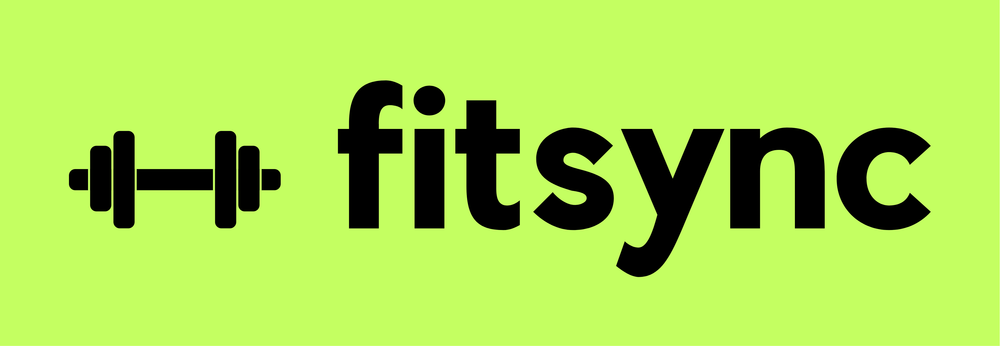

# FitSync (Projeto de Estudo)  

  
    
  <h3>Aplicação para gestão de treinos em academias</h3>  
  
<i>Projeto desenvolvido para praticar conceitos de C# e PostgreSQL.</i>
  

  

---

## 🧠 Objetivo  
Este projeto é uma **simulação de um sistema real**, criado para consolidar conhecimentos em:  
- **C#** (POO, Entity Framework, APIs)  
- **PostgreSQL** (modelagem de dados, queries complexas)  
- Arquitetura em camadas (Services, Repositories, DTOs).  

---

## 🚀 Funcionalidades Principais  
### Para Personal Trainers  
- Criar treinos com exercícios, séries e repetições.  
- Acompanhar evolução dos alunos (cargas, frequência).  
- Enviar mensagens diretas aos alunos.  

### Para Alunos  
- Visualizar treinos com detalhes e vídeos demonstrativos.  
- Registrar progresso diário (carga, repetições).  
- Receber notificações de novos treinos.  

---

## 🛠 Tecnologias  
  
  
  

**Ferramentas complementares:**   
- xUnit (testes unitários)  
