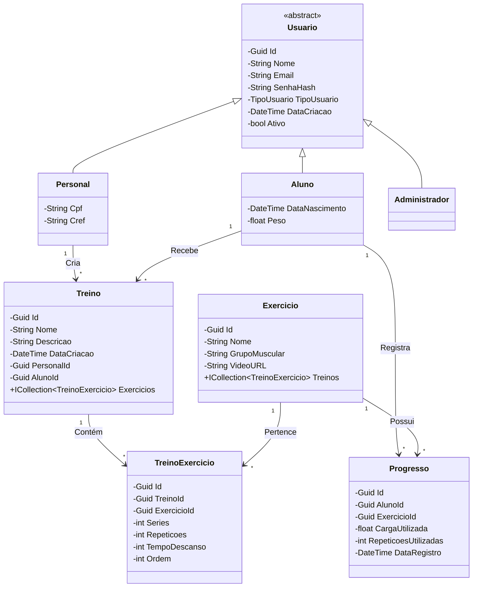
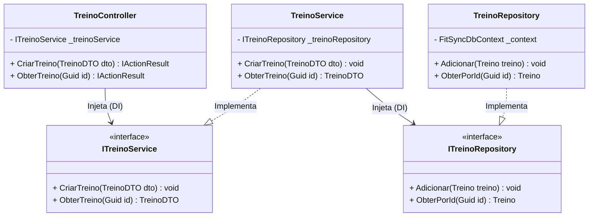
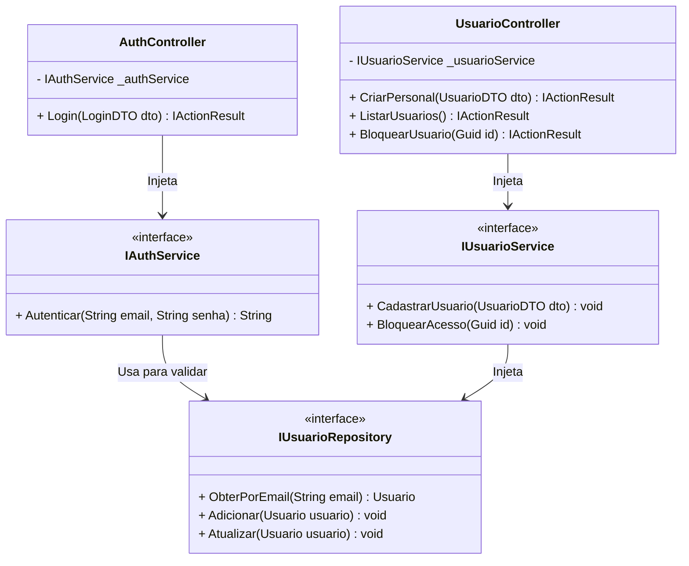

Diagrama de classe (Dominio)

```mermaid
classDiagram
    Usuario <|-- Aluno
    Usuario <|-- Personal
    Usuario <|-- Administrador

    class Usuario {
        <<abstract>>
        -Guid Id
        -String Nome
        -String Email
        -String SenhaHash
        -TipoUsuario TipoUsuario
        -DateTime DataCriacao
        -bool Ativo
    }

    class Aluno {
        -DateTime DataNascimento
        -float Peso
    }

    class Personal {
        -String Cpf
        -String Cref
    }

    class Administrador {
    }

    class Treino {
        -Guid Id
        -String Nome
        -String Descricao
        -DateTime DataCriacao
        -Guid PersonalId
        -Guid AlunoId
        +ICollection~TreinoExercicio~ Exercicios
    }

    class Exercicio {
        -Guid Id
        -String Nome
        -String GrupoMuscular
        -String VideoURL
        +ICollection~TreinoExercicio~ Treinos
    }

    class TreinoExercicio {
        -Guid Id
        -Guid TreinoId
        -Guid ExercicioId
        -int Series
        -int Repeticoes
        -int TempoDescanso
        -int Ordem
    }

    class Progresso {
        -Guid Id
        -Guid AlunoId
        -Guid ExercicioId
        -float CargaUtilizada
        -int RepeticoesUtilizadas
        -DateTime DataRegistro
    }

    Personal "1" --> "*" Treino : Cria
    Aluno "1" --> "*" Treino : Recebe
    Treino "1" --> "*" TreinoExercicio : Contém
    Exercicio "1" --> "*" TreinoExercicio : Pertence
    Aluno "1" --> "*" Progresso : Registra
    Exercicio "1" --> "*" Progresso : Possui
```
Diagrama de Arquitetura

```mermaid
classDiagram

    class TreinoController {
        - ITreinoService _treinoService
        + CriarTreino(TreinoDTO dto) IActionResult
        + ObterTreino(Guid id) IActionResult
    }


    class ITreinoService {
        <<interface>>
        + CriarTreino(TreinoDTO dto) void
        + ObterTreino(Guid id) TreinoDTO
    }

    class TreinoService {
        - ITreinoRepository _treinoRepository
        + CriarTreino(TreinoDTO dto) void
        + ObterTreino(Guid id) TreinoDTO
    }

    class ITreinoRepository {
        <<interface>>
        + Adicionar(Treino treino) void
        + ObterPorId(Guid id) Treino
    }

    class TreinoRepository {
        - FitSyncDbContext _context
        + Adicionar(Treino treino) void
        + ObterPorId(Guid id) Treino
    }

    TreinoController --> ITreinoService : Injeta (DI)
    TreinoService --> ITreinoRepository : Injeta (DI)

    TreinoService ..|> ITreinoService : Implementa
    TreinoRepository ..|> ITreinoRepository : Implementa
```
Arquitetura de segurança

```mermaid
classDiagram
    %% API - Autenticação e Usuários
    class AuthController {
        - IAuthService _authService
        + Login(LoginDTO dto) IActionResult
    }

    class UsuarioController {
        - IUsuarioService _usuarioService
        + CriarPersonal(UsuarioDTO dto) IActionResult
        + ListarUsuarios() IActionResult
        + BloquearUsuario(Guid id) IActionResult
    }

    class IAuthService {
        <<interface>>
        + Autenticar(String email, String senha) String
    }

    class IUsuarioService {
        <<interface>>
        + CadastrarUsuario(UsuarioDTO dto) void
        + BloquearAcesso(Guid id) void
    }

    class IUsuarioRepository {
        <<interface>>
        + ObterPorEmail(String email) Usuario
        + Adicionar(Usuario usuario) void
        + Atualizar(Usuario usuario) void
    }

    AuthController --> IAuthService : Injeta
    UsuarioController --> IUsuarioService : Injeta

    IAuthService --> IUsuarioRepository : Usa para validar
    IUsuarioService --> IUsuarioRepository : Injeta
```
