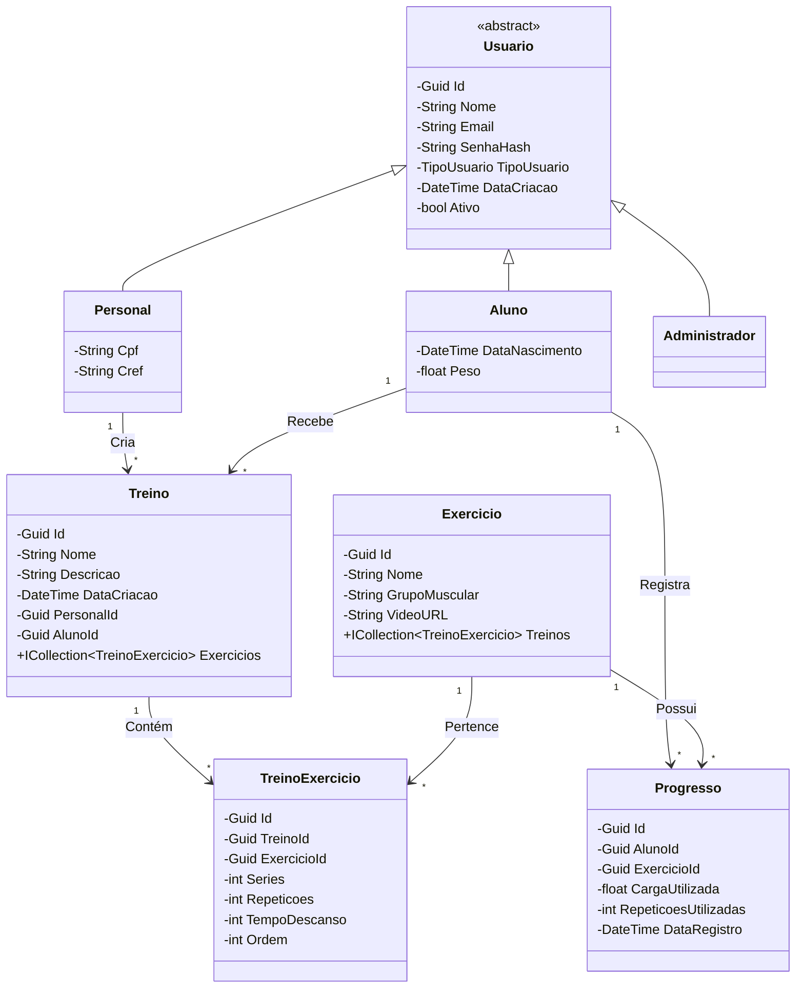

```mermaid
classDiagram
    Usuario <|-- Aluno
    Usuario <|-- Personal
    Usuario <|-- Administrador

    class Usuario {
        <<abstract>>
        -Guid Id
        -String Nome
        -String Email
        -String SenhaHash
        -TipoUsuario TipoUsuario
        -DateTime DataCriacao
        -bool Ativo
    }

    class Aluno {
        -DateTime DataNascimento
        -float Peso
    }

    class Personal {
        -String Cpf
        -String Cref
    }

    class Administrador {
    }

    class Treino {
        -Guid Id
        -String Nome
        -String Descricao
        -DateTime DataCriacao
        -Guid PersonalId
        -Guid AlunoId
        +ICollection~TreinoExercicio~ Exercicios
    }

    class Exercicio {
        -Guid Id
        -String Nome
        -String GrupoMuscular
        -String VideoURL
        +ICollection~TreinoExercicio~ Treinos
    }

    class TreinoExercicio {
        -Guid Id
        -Guid TreinoId
        -Guid ExercicioId
        -int Series
        -int Repeticoes
        -int TempoDescanso
        -int Ordem
    }

    class Progresso {
        -Guid Id
        -Guid AlunoId
        -Guid ExercicioId
        -float CargaUtilizada
        -int RepeticoesUtilizadas
        -DateTime DataRegistro
    }

    Personal "1" --> "*" Treino : Cria
    Aluno "1" --> "*" Treino : Recebe
    Treino "1" --> "*" TreinoExercicio : Contém
    Exercicio "1" --> "*" TreinoExercicio : Pertence
    Aluno "1" --> "*" Progresso : Registra
    Exercicio "1" --> "*" Progresso : Possui
```
